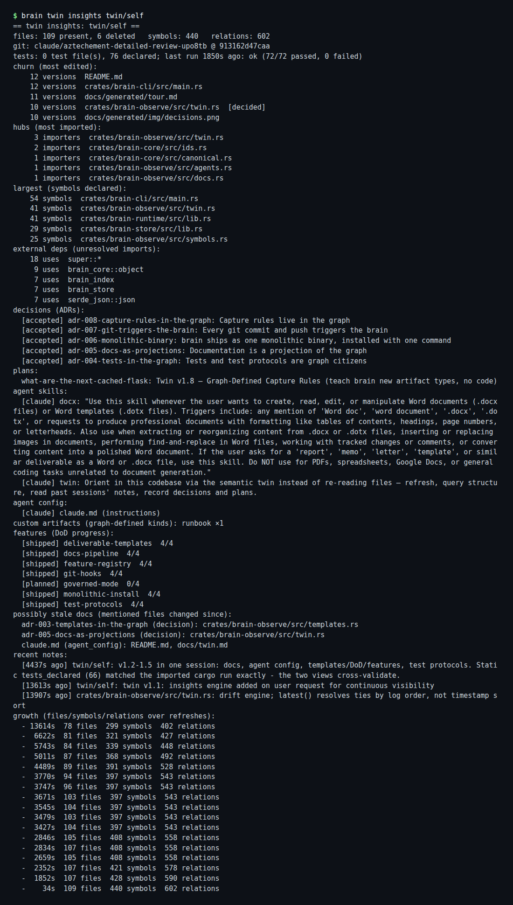
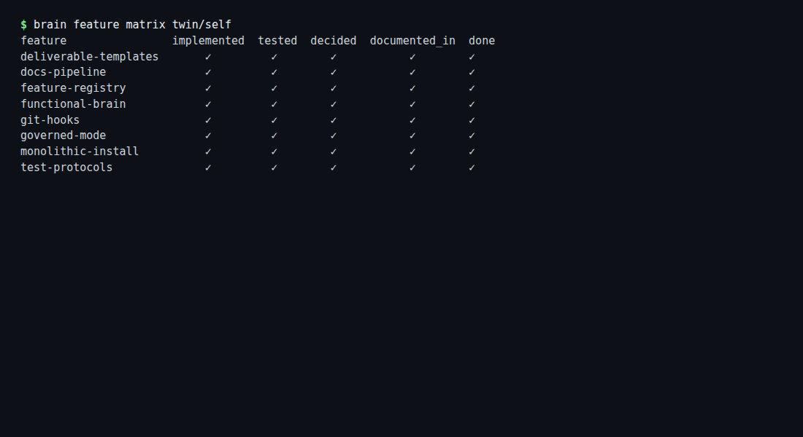

# Live tour: `twin/self`

> Generated by `brain docs generate` from the graph.
> Every section is a query result — regenerate, never edit.

## Insights (`brain twin insights`)
```
== twin insights: twin/self ==
last sleep (6223s ago): 0 added, 5 changed file(s); 3 doc update(s); 0 protocol(s); last run 110/110 ok; 1 note(s); 3 memory digest(s); attention: crates/brain-core/src/ids.rs, crates/brain-core/src/object.rs, crates/brain-store/src/lib.rs
files: 167 present, 1 deleted   symbols: 944   relations: 1334
git: claude/aztechement-detailed-review-upo8tb @ c4b686cb4ea8
tests: 0 test file(s), 145 declared; last run 58s ago: ok (132/132 passed, 0 failed)
churn (most edited):
     6 versions  crates/brain-eyes/assets/app.js
     6 versions  crates/brain-eyes/src/lib.rs
     5 versions  crates/brain-cli/src/main.rs
     5 versions  crates/brain-cli/src/manual.rs
     5 versions  crates/brain-observe/src/twin.rs  [decided]
  … showing 5 of 46 churned files
hubs (most imported):
    38 importers  crates/brain-core/src/ids.rs
    31 importers  crates/brain-core/src/object.rs
    29 importers  crates/brain-store/src/lib.rs
    27 importers  crates/brain-index/src/lib.rs
    23 importers  crates/brain-observe/src/twin.rs
  … showing 5 of 31
untested hubs (imported, no tests):
     9 importers  crates/brain-eyes/src/dto.rs
     9 importers  crates/brain-eyes/src/state.rs
     7 importers  crates/brain-eyes/src/query/mod.rs
     7 importers  crates/brain-observe/src/lib.rs
     4 importers  crates/brain-core/src/lib.rs
  … showing 5 of 8
largest (symbols declared):
    80 symbols  design-draft/support.js
    71 symbols  crates/brain-cli/src/main.rs
    65 symbols  crates/brain-observe/src/twin.rs
    41 symbols  crates/brain-runtime/src/lib.rs
    33 symbols  crates/brain-eyes/src/dto.rs
  … showing 5 of 56
external deps (unresolved imports):
    35 uses  super::*
    22 uses  std::fs
    19 uses  std::collections
    11 uses  std::collections::BTreeMap
     7 uses  serde_json::json
  … showing 5 of 44
decisions (ADRs, 23 active):
  [accepted] adr-024-eyes-shows-judgments-and-content: Eyes shows judgments and content, not the graph
  [accepted] adr-017-artifact-kind-registry: The artifact-kind registry: built-ins are pre-taught defaults
  [accepted] adr-018-placement-policy-and-assets: Placement policy: where each artifact kind's truth lives
  [accepted] adr-019-read-only-projection-contract: The read-only projection contract
  [accepted] adr-020-opt-in-enforcement-gates: Opt-in enforcement gates, and exit code 3
  … showing 5 of 23 decisions
agent skills:
  [claude] twin: Orient in this codebase via the semantic twin instead of re-reading files — refresh, query structure, read past sessions' notes, record decisions and plans.
agent config:
  [generic] agents.md (instructions)
  [claude] claude.md (instructions)
custom artifacts (graph-defined kinds): doc ×7, runbook ×1
features (DoD progress):
  [building] eyes  4/4
  [active] governed-changes  4/4
  [active] semantic-twin  4/4
possibly stale docs (mentioned files changed since):
  [warn] readme (doc): crates/brain-core/src/object.rs, crates/brain-observe/src/symbols.rs, crates/brain-observe/src/twin.rs
  [warn] release (runbook): Cargo.toml
  [info] adr-001-relation-predicate-field (decision): crates/brain-core/src/object.rs, crates/brain-index/src/lib.rs
  [info] adr-002-alpha-normalization-at-store-boundary (decision): crates/brain-cli/src/tasks.rs, crates/brain-core/src/object.rs, crates/brain-store/src/lib.rs, crates/brain-store/src/sync.rs
  [info] adr-003-templates-in-the-graph (decision): crates/brain-observe/src/docs.rs, crates/brain-observe/src/features.rs, crates/brain-observe/src/templates.rs
  … showing 5 of 22 stale docs
recent notes:
  [6253s ago] twin/self: Eyes artifact model corrected: artifact bodies are now first-class read-only projections. Markdown and structured text render from graph-snapshot content; hash-verified workspace binaries have safe raw previews; source code remains inspectable in separate Code dossiers but is excluded from Artifacts, as are test runs. Artifact inventory is 43 authored deliverables instead of 198 mixed entities. Desktop/mobile browser QA passed with no runtime warnings, and all 123 workspace tests pass.
  [63597s ago] twin/self: Eyes depth parity completed: all meaningful cockpit surfaces, five Work layouts, universal entity dossiers, semantic MRI projections, snapshot comparison, cached global search, and two-step reachability are graph-backed and browser-verified across desktop and mobile. Unmodeled actors, sessions, approvals, mutation controls, raw content, and simulated prototype states remain explicitly unavailable. All 120 workspace tests pass.
  [68328s ago] twin/self: Eyes concept-parity milestone: added graph-connected Artifacts, Evidence, and History surfaces; introduced scoped human-readable /api/history projection; corrected artifact freshness semantics; made History lazy-loaded; verified responsive cockpit UI in the in-app browser; cargo test --workspace passes all 114 tests; JavaScript syntax and live APIs verified.
  [73058s ago] twin/self: Eyes concept-parity milestone: ported the prototype cockpit shell, added graph-backed Now and Features, shipped the MRI live-activity projection with lenses, modes, time windows, neighbor isolation, search, and inspector; seeded truthful Eyes, Semantic Twin, and Governed Changes features; 113 workspace tests and desktop/mobile browser QA passed.
  [77077s ago] twin/self: Eyes discovery: make it a read-only human projection over Store plus Cortex, served by the monolithic brain binary. V1 should expose truthful Now/attention, graph explore and entity detail, live relations, history/as-of, and blast radius. Reuse the design-draft visual language and MRI lenses, but defer agent sessions, approval UI, and rich feature dashboards until those concepts have real graph data. Prefer localhost-only brain eyes with embedded assets, JSON snapshot endpoints, and SSE driven by the event-log cursor; no second database and no write endpoints in v1.
  … showing 5 of 7 notes
growth (files/symbols/relations over refreshes):
  - 93494s  121 files  529 symbols  743 relations
  - 90099s  128 files  578 symbols  817 relations
  - 87539s  142 files  664 symbols  960 relations
  - 87525s  144 files  664 symbols  960 relations
  - 77326s  146 files  744 symbols  1040 relations
  - 75386s  151 files  813 symbols  1120 relations
  - 74786s  152 files  813 symbols  1120 relations
  - 73759s  153 files  813 symbols  1120 relations
  - 73072s  153 files  826 symbols  1133 relations
  - 68344s  153 files  840 symbols  1147 relations
  - 63627s  154 files  908 symbols  1215 relations
  -  6534s  154 files  926 symbols  1234 relations
  -   186s  167 files  944 symbols  1334 relations
```

## Feature matrix — definition of done (`brain feature matrix`)
```
feature           implemented  tested  decided  documented_in  done
eyes                   ✓         ✓        ✓           ✓        ✓
governed-changes       ✓         ✓        ✓           ✓        ✓
semantic-twin          ✓         ✓        ✓           ✓        ✓
```

## Decisions (`brain adr list`)
```
[accepted] adr-014-relation-currency-via-edge-tombstones: Relation currency via edge tombstones  (90099s ago, 2 mention(s))
[accepted] adr-016-wake-and-the-sleep-window: Wake, and the sleep watermark as the universal recency window  (90099s ago, 3 mention(s))
[accepted] adr-010-governed-mode: Governed mode: changes to twinned software go through the effect boundary  (93494s ago, 1 mention(s))
[accepted] adr-003-templates-in-the-graph: Deliverable templates live in the graph  (93494s ago, 3 mention(s))
[accepted] adr-013-lifecycle-as-derived-judgment: Artifact lifecycle is a derived judgment, not a stored fact  (90099s ago, 2 mention(s))
[accepted] adr-005-docs-as-projections: Documentation is a projection of the graph  (93494s ago, 1 mention(s))
[accepted] adr-002-alpha-normalization-at-store-boundary: Alpha-normalization happens at the store boundary  (93494s ago, 4 mention(s))
[accepted] adr-021-tidy-through-governed-changes: Tidy acts only through governed changes  (87539s ago, 1 mention(s))
[accepted] adr-019-read-only-projection-contract: The read-only projection contract  (87539s ago, 1 mention(s))
[accepted] adr-018-placement-policy-and-assets: Placement policy: where each artifact kind's truth lives  (87539s ago, 2 mention(s))
[accepted] adr-020-opt-in-enforcement-gates: Opt-in enforcement gates, and exit code 3  (87539s ago, 0 mention(s))
[accepted] adr-006-monolithic-binary: brain ships as one monolithic binary, installed with one command  (93494s ago, 5 mention(s))
[accepted] adr-017-artifact-kind-registry: The artifact-kind registry: built-ins are pre-taught defaults  (87539s ago, 3 mention(s))
[accepted] adr-022-template-fitness: Template fitness: contracts are measured, evolution is approved  (87539s ago, 1 mention(s))
[accepted] adr-011-cortex: cortex: our own persistent graph-query engine  (93494s ago, 0 mention(s))
[accepted] adr-009-functional-brain-not-structural: A functional brain, not a structural one  (93494s ago, 3 mention(s))
[accepted] adr-008-capture-rules-in-the-graph: Capture rules live in the graph  (93494s ago, 3 mention(s))
[accepted] adr-024-eyes-shows-judgments-and-content: Eyes shows judgments and content, not the graph  (32s ago, 0 mention(s))
[accepted] adr-015-staleness-severity-and-acknowledgement: Staleness carries severity and can be acknowledged  (90099s ago, 2 mention(s))
[accepted] adr-004-tests-in-the-graph: Tests and test protocols are graph citizens  (93494s ago, 1 mention(s))
[accepted] adr-012-backfill-history-with-historical-timestamps: Backfilled history carries historical timestamps  (93494s ago, 1 mention(s))
[accepted] adr-007-git-triggers-the-brain: Every git commit and push triggers the brain  (93494s ago, 2 mention(s))
[accepted] adr-001-relation-predicate-field: Relation's edge label is a field named `predicate`, not `kind`  (93494s ago, 3 mention(s))
(1 non-active hidden — --all shows history)
```

## Tests (`brain twin tests`)
```
crates/brain-cli/src/docsgen.rs  [rust] 1 test(s), inline tests
crates/brain-cli/src/hooks.rs  [rust] 4 test(s), inline tests
crates/brain-cli/src/manual.rs  [rust] 1 test(s), inline tests
crates/brain-cli/src/notation.rs  [rust] 4 test(s), inline tests
crates/brain-cli/src/tasks.rs  [rust] 2 test(s), inline tests
crates/brain-core/src/canonical.rs  [rust] 4 test(s), inline tests
crates/brain-core/src/ids.rs  [rust] 3 test(s), inline tests
crates/brain-core/src/object.rs  [rust] 6 test(s), inline tests
crates/brain-eyes/src/lib.rs  [rust] 13 test(s), inline tests
crates/brain-eyes/src/say.rs  [rust] 4 test(s), inline tests
crates/brain-eyes/src/tests.rs  [rust] 18 test(s), inline tests
crates/brain-index/src/lib.rs  [rust] 4 test(s), inline tests
crates/brain-observe/src/agents.rs  [rust] 3 test(s), inline tests
crates/brain-observe/src/assets.rs  [rust] 1 test(s), inline tests
crates/brain-observe/src/assoc.rs  [rust] 1 test(s), inline tests
crates/brain-observe/src/attention.rs  [rust] 2 test(s), inline tests
crates/brain-observe/src/backfill.rs  [rust] 1 test(s), inline tests
crates/brain-observe/src/coherence.rs  [rust] 1 test(s), inline tests
crates/brain-observe/src/docs.rs  [rust] 4 test(s), inline tests
crates/brain-observe/src/fitness.rs  [rust] 1 test(s), inline tests
crates/brain-observe/src/govern.rs  [rust] 4 test(s), inline tests
crates/brain-observe/src/instructions.rs  [rust] 1 test(s), inline tests
crates/brain-observe/src/kinds.rs  [rust] 2 test(s), inline tests
crates/brain-observe/src/lifecycle.rs  [rust] 1 test(s), inline tests
crates/brain-observe/src/projection.rs  [rust] 1 test(s), inline tests
crates/brain-observe/src/sleep.rs  [rust] 1 test(s), inline tests
crates/brain-observe/src/symbols.rs  [rust] 5 test(s), inline tests
crates/brain-observe/src/templates.rs  [rust] 7 test(s), inline tests
crates/brain-observe/src/testing.rs  [rust] 3 test(s), inline tests
crates/brain-observe/src/tidy.rs  [rust] 1 test(s), inline tests
crates/brain-observe/src/twin.rs  [rust] 19 test(s), inline tests
crates/brain-observe/src/wake.rs  [rust] 1 test(s), inline tests
crates/brain-runtime/src/lib.rs  [rust] 8 test(s), inline tests
crates/brain-store/src/intents.rs  [rust] 2 test(s), inline tests
crates/brain-store/src/lib.rs  [rust] 5 test(s), inline tests
crates/brain-store/src/sync.rs  [rust] 2 test(s), inline tests
crates/cortex/src/lib.rs  [rust] 4 test(s), inline tests
```

## Test protocols (`brain testrun list`)
```
[    59s ago] ok: 132/132 passed, 0 failed (cargo)
[ 85414s ago] ok: 110/110 passed, 0 failed (cargo)
[ 87395s ago] ok: 110/110 passed, 0 failed (cargo)
[ 90058s ago] ok: 100/100 passed, 0 failed (cargo)
```

## Attention (`brain attend`)
```
 1. [ 76] crates/brain-core/src/ids.rs (file)  — hub 38
 2. [ 64] crates/brain-core/src/object.rs (file)  — churn 2 (0 recent), hub 31
 3. [ 60] crates/brain-store/src/lib.rs (file)  — churn 2 (0 recent), hub 29
 4. [ 57] crates/brain-index/src/lib.rs (file)  — churn 3 (0 recent), hub 27
 5. [ 55] crates/brain-observe/src/twin.rs (file)  — churn 5 (1 recent), hub 23
 6. [ 50] crates/brain-eyes/src/dto.rs (file)  — churn 1 (1 recent), hub 9, untested hub
 7. [ 50] crates/brain-eyes/src/state.rs (file)  — churn 1 (1 recent), hub 9, untested hub
 8. [ 40] crates/brain-eyes/src/query/mod.rs (file)  — churn 1 (1 recent), hub 7, untested hub
 9. [ 39] crates/brain-observe/src/lib.rs (file)  — churn 4 (0 recent), hub 7, untested hub
10. [ 20] crates/brain-core/src/lib.rs (file)  — hub 4, untested hub
```

## Doc staleness (`brain twin stale`)
```
[warn] readme (doc) — changed since doc updated or acknowledged:
  crates/brain-core/src/object.rs
  crates/brain-observe/src/symbols.rs
  crates/brain-observe/src/twin.rs
[warn] release (runbook) — changed since doc updated or acknowledged:
  Cargo.toml
[info] adr-001-relation-predicate-field (decision) — changed since doc updated or acknowledged:
  crates/brain-core/src/object.rs
  crates/brain-index/src/lib.rs
[info] adr-002-alpha-normalization-at-store-boundary (decision) — changed since doc updated or acknowledged:
  crates/brain-cli/src/tasks.rs
  crates/brain-core/src/object.rs
  crates/brain-store/src/lib.rs
  crates/brain-store/src/sync.rs
[info] adr-003-templates-in-the-graph (decision) — changed since doc updated or acknowledged:
  crates/brain-observe/src/docs.rs
  crates/brain-observe/src/features.rs
  crates/brain-observe/src/templates.rs
[info] adr-004-tests-in-the-graph (decision) — changed since doc updated or acknowledged:
  crates/brain-observe/src/testing.rs
[info] adr-005-docs-as-projections (decision) — changed since doc updated or acknowledged:
  crates/brain-observe/src/twin.rs
[info] adr-006-monolithic-binary (decision) — changed since doc updated or acknowledged:
  crates/brain-cli/src/docsgen.rs
[info] adr-007-git-triggers-the-brain (decision) — changed since doc updated or acknowledged:
  Cargo.toml
  crates/brain-cli/src/hooks.rs
[info] adr-008-capture-rules-in-the-graph (decision) — changed since doc updated or acknowledged:
  crates/brain-observe/src/docs.rs
  crates/brain-observe/src/templates.rs
  crates/brain-observe/src/twin.rs
[info] adr-009-functional-brain-not-structural (decision) — changed since doc updated or acknowledged:
  crates/brain-observe/src/assoc.rs
  crates/brain-observe/src/attention.rs
  crates/brain-observe/src/sleep.rs
[info] adr-010-governed-mode (decision) — changed since doc updated or acknowledged:
  crates/brain-observe/src/govern.rs
[info] adr-012-backfill-history-with-historical-timestamps (decision) — changed since doc updated or acknowledged:
  crates/brain-observe/src/backfill.rs
[info] adr-013-lifecycle-as-derived-judgment (decision) — changed since doc updated or acknowledged:
  crates/brain-observe/src/docs.rs
  crates/brain-observe/src/lifecycle.rs
[info] adr-014-relation-currency-via-edge-tombstones (decision) — changed since doc updated or acknowledged:
  crates/brain-index/src/lib.rs
  crates/brain-observe/src/twin.rs
[info] adr-015-staleness-severity-and-acknowledgement (decision) — changed since doc updated or acknowledged:
  CLAUDE.md
  crates/brain-observe/src/twin.rs
[info] adr-016-wake-and-the-sleep-window (decision) — changed since doc updated or acknowledged:
  README.md
  crates/brain-observe/src/attention.rs
  crates/brain-observe/src/wake.rs
[info] adr-017-artifact-kind-registry (decision) — changed since doc updated or acknowledged:
  README.md
  crates/brain-observe/src/kinds.rs
[info] adr-018-placement-policy-and-assets (decision) — changed since doc updated or acknowledged:
  README.md
  crates/brain-observe/src/assets.rs
[info] adr-019-read-only-projection-contract (decision) — changed since doc updated or acknowledged:
  crates/brain-observe/src/projection.rs
[info] adr-021-tidy-through-governed-changes (decision) — changed since doc updated or acknowledged:
  crates/brain-observe/src/tidy.rs
[info] adr-022-template-fitness (decision) — changed since doc updated or acknowledged:
  crates/brain-observe/src/fitness.rs
(2 warn, 20 info; reviewed-and-still-accurate? `brain adr|plan|artifact ack`)
```





Screencast: [tour.webm](tour.webm) — narrated: [tour-narrated.webm](tour-narrated.webm)
